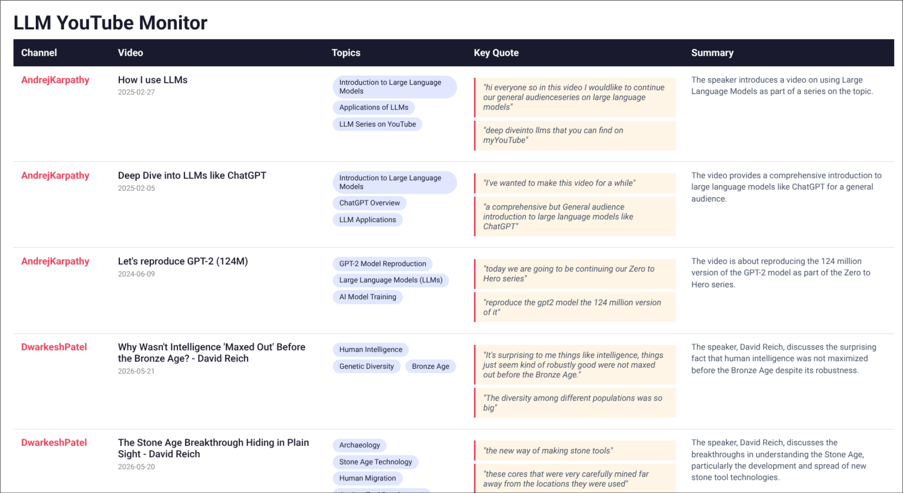

# yt-watcher

## Problem Statement

Write a python script to analyse videos of select few AI channels and summarise their content to display on a live webpage

### Key challenges addressed:

- How to automatically extract what creators actually say (not just titles)
- How to categorize content by topics across multiple channels
- How to keep information current as new videos are published
- Limitations and how to solve them

## Methodology

Initially I had the plan of passing the video transcript to LLM for analysis but I didn't know how to host a   
live webpage. I came across GitHub Pages and then I used it to host the HTML page, and used GitHub Actions to run 
the script periodically.

## Evalutation Dataset
 
Data is collected from the following channels: 

- Andrej Karpathy 
- Dwarkesh Patel 
- Wes Roth 
- AI Explained 
- Krish Naik
- Sebastian Raschka

## Evaluation Methods

- uses YouTube API for calling information on select few channels using Google YouTube API
- uses yt-transcript API for obtaining transcripts from videos and processes them to obtain raw transcripts
- passes the transcript to OpenAI API (Groq Llama 3.3) for analysis
- receives summary and writes an HTML file with information (obtained in JSON format)
- HTML page displayed on GitHub pages
- script is run automatically every 12 hours using GitHub actions

## Evalutation Results

Screenshot from the live webpage is attached 

## Limitations

Due to using the Free tier of all of the APIs mentioned above, number of requests I can call are really limited.  
This is why this script can only analyse about 3 videos with the transcript truncated to about 200 characters, so  
the analysis is not optimal. To make the analysis even better, Premium tiers of the APIs can be used and this   
will help to prevent a lot of the limitations of this script.
 